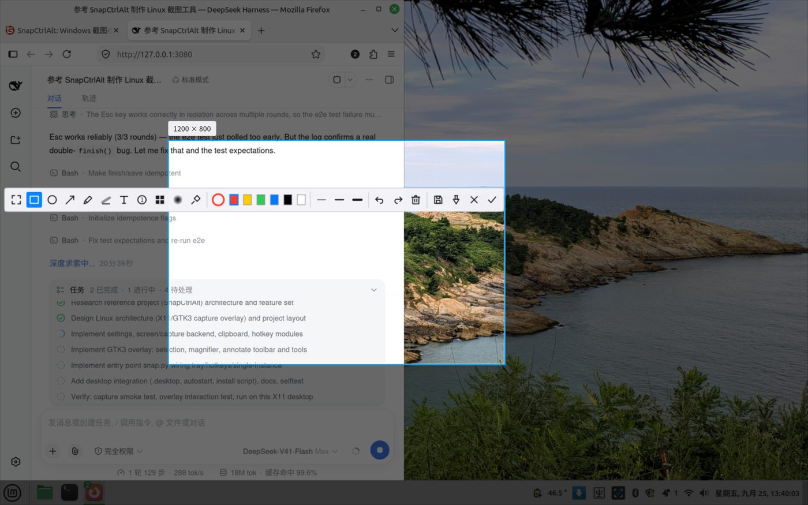

# SnapCtrlAlt Linux

Linux 截图小工具：按 `Ctrl+Alt+D` 全局唤起，框选标注后进剪贴板。交互对标 QQ 截图，
界面用 GTK3 + Cairo，抓图走 X11（Xlib / GDK），除系统自带的 Python 库外不需要编译任何东西。

> 状态：**beta**（`1.5.2`；1.3.0 是第一个对外版本，1.0.0–1.2.5 为内部 alpha）。
>
> 这是 Windows 项目 [SnapCtrlAlt](https://gitee.com/DannyParticle/SnapCtrlAlt) 的 Linux 版移植，
> 保留了它的全部交互设计（工具集、工具栏、快捷键、放大镜、贴图、托盘分流逻辑），
> 渲染层从 Tk 画布 + Pillow 换成 Cairo 直接绘制。



*框选后可拖手柄调整、整体平移，工具栏自绘线性图标，悬停出中文提示。*

## 功能

**框选与选区**

- 拖动框选；拖 8 个手柄改大小；在选区内拖动可整体平移；方向键微调（`Shift` 加速）
- 双击或 `Ctrl+A` 选整屏
- 框选时带 8× 放大镜、十字准星、坐标读数与 `#RRGGBB` 色值，旁边有实时尺寸标签
- 标注过程中在选区外按下即可重新框选（不必 Esc 全退）——**可在设置里关掉**：
  「点选区外时重新框选」默认关，关掉后选好的区域不会被误清（要重选按 `C` 或双击）

**标注工具栏**（Cairo 自绘线性图标，不依赖图标字体，鼠标悬停出中文提示）

| 工具 | 说明 |
|------|------|
| 矩形 / 椭圆 / 箭头 | 常用圈注 |
| 画笔 | 自由涂画，滚轮调线宽 |
| 荧光笔 | 半透明涂抹重点 |
| 文字 | 点击落字，用 Pango 渲染（中文、emoji 都能显示） |
| 序号 | 点击添加 ①②③ 圆形序号，自动递增 |
| 马赛克 / 高斯模糊 | 遮挡敏感信息 |
| 取色 | 读出画面颜色并设为当前描边色 |
| 颜色 | 点色环展开**工具栏自带的取色面板**：`R`/`G`/`B` 渐变滑块 + 灰度（亮度）滑块 + 12 个常用色 + 取色器，面板与工具栏同宽、不会超出 |
| 临时切换 | `Ctrl+E` 在 **①↔③ 之间双向切换**（覆盖层里切到编辑器、编辑器里切回覆盖层），画好的标注与选区一起带过去 |
| 换边 / 沿边滑动 | 点工具栏四角的小三角可把整条贴到上/下/左/右（贴左右时自动竖排）；按住条上的空白处拖动可沿边滑动，永远不出屏幕 |
| 撤销 / 重做 / 清空 / 另存为 / 贴图 / 取消 / 完成 | 收尾操作 |

**常驻与分流**

- 系统托盘常驻（Ayatana AppIndicator，退回 `Gtk.StatusIcon`）：立即截图、延时截图、
  开机自启、外部工具优先、复制后自动存一份、设置、关于、退出
- 开机自启写 `~/.config/autostart/snapctrlalt.desktop`
- 已装 Flameshot / Spectacle / gnome-screenshot 等外部工具时，可让它们优先接管
  （对标 Windows 版的「优先 QQ 截图」；托盘与设置里随时开关）
- 贴图：把截图钉成置顶小窗，滚轮缩放、右键菜单可复制/保存/调透明度

**Linux 特有的照顾**

- **HiDPI**：覆盖层固定在设备像素尺度运行（`GDK_SCALE=1`），让
  **GTK 事件坐标 = 覆盖层窗口 = X11 根窗口 = 抓图像素** 四者同源，
  坐标链上只剩一次整数换算，从根上消除「圈的位置和截的位置不一致」。
  启动时还会用 Xlib 根指针对账 GTK 事件坐标，发现残留的平移/缩放就自动纠正并记日志；
  万一你的环境仍有偏差，可用 `SNAP_SCALE` / `SNAP_OFFSET_X` / `SNAP_OFFSET_Y` 手动指定。
  UI（工具栏/放大镜/手柄）另外按显示器缩放系数放大，因此坐标精确的同时界面也不缩水
- **多显示器**：按 Xinerama / RandR 拼出虚拟屏并集，覆盖层铺满整块虚拟屏
- **Wayland**：纯 Wayland 会话自动改走 XDG Desktop Portal（会弹一次系统授权框），
  抓到的图仍进同一套标注界面
- **剪贴板**：写 `image/png` 并调用 `store()`，有剪贴板管理器时**退出程序后仍可粘贴**
- **改了代码但界面没变？** 常驻实例不会自动换代码（进程启动时就把源码读进内存了）。
  跑 `python3 tools/restart_resident.py` 检查、加 `--restart` 重启；同一个脚本还会
  提示"已安装的 deb 落后于源码"，那种情况重启也没用，要重新装包
- **键盘焦点**：显式 `_NET_ACTIVE_WINDOW` + X11 `set_input_focus` 兜底，
  避免「窗口显示了但 Enter/Esc 跑到别的程序去」

## 安装与运行

**Debian 包（推荐）**

```bash
./packaging/build-deb.sh                 # 产物在 dist/snapctrlalt_<版本>_all.deb
sudo apt install ./dist/snapctrlalt_1.5.2_all.deb
```

装完在应用菜单里搜「截图工具」，或直接敲 `snapctrlalt`。
**deb 装完默认不开机自启**，需要的话在托盘菜单里勾选「开机自启」。
构建是可复现的（固定 `SOURCE_DATE_EPOCH`，同一份源码每次构建出的 deb 字节一致）。

**免安装（源码目录直接跑）**

```bash
git clone https://github.com/DannyParticle/snapctrlalt-linux.git && cd snapctrlalt-linux
./snapctrlalt.sh            # 托盘常驻
```

**安装到 ~/.local（不用 root）**

```bash
./install.sh                # 图标 / 启动器 / 命令行入口
./install.sh --autostart    # 顺便开机自启
./install.sh --uninstall    # 卸载（保留配置）
```

**依赖**

Linux Mint / Ubuntu / Debian：

```bash
sudo apt install python3-gi python3-gi-cairo python3-cairo python3-pil \
                 gir1.2-gtk-3.0 python3-xlib gir1.2-ayatanaappindicator3-0.1
```

Fedora：

```bash
sudo dnf install python3-gobject python3-cairo python3-pillow gtk3 python3-xlib \
                 libappindicator-gtk3
```

Arch：

```bash
sudo pacman -S python-gobject python-cairo python-pillow gtk3 python-xlib \
               libayatana-appindicator
```

（`requirements.txt` 里有同样的清单与说明。用系统包而不是 pip 装 PyGObject，
可以避免和系统 GTK 版本打架。）

**从源码跑**

```bash
./snapctrlalt.sh --selftest    # 不弹界面，基础自检（含坐标标定），退出码 0 为通过
./snapctrlalt.sh               # 托盘常驻
./snapctrlalt.sh --once        # 只截一次，截完退出
./snapctrlalt.sh --settings    # 打开设置
python3 tools/diagnose.py      # 环境诊断：这台机器能用哪些能力
python3 tools/perf.py          # 帧耗时基准
```

也可以直接用入口脚本：`bin/snapctrlalt --once`。

## 工具栏的三个方案

历史上试过三种放工具栏的方式，**当前对外只有前两种可用**：

| # | 方案 | 形态 | 状态 |
|---|------|------|------|
| ① | `canvas` | 工具栏画在覆盖层上，自动贴在选区下方（跟着选区走，不遮挡选区） | ✅ 默认 |
| ② | `mask` | 工具栏作为**独立窗口**浮在选区外的遮罩上（最初想要"带关闭按钮的常规窗口"那种） | ❌ **已屏蔽**（见下） |
| ③ | `editor` | 选完区域后开一个**普通编辑器窗口**：中间是截图、上面是工具栏、带标题栏与关闭按钮 | ✅ 可用 |

**在设置里切换**：「界面与启动 → 工具栏形态」，或在覆盖层里按 `Ctrl+E` 在 ①↔③ 之间即时切换。
配置文件键是 `toolbar_mode`。

### 方案② 为什么屏蔽了

它是**真的不能用**，不是没做好：

- 窗口**能创建、几何也正确**（实测 `700,870`，`1204×152`），但屏幕上**一个像素都不显示** —— 被全屏覆盖层完全盖住；
- 同时**收不到任何鼠标事件**（连 `enter`/`motion` 都没有），点击会落到下层的其它程序上；
- 根因：**窗口管理器不允许后台程序把自己的窗口提到活动窗口之上**（防抢焦点）。
  `set_transient_for` + `present()`、X11 `_NET_ACTIVE_WINDOW` 消息、去掉
  `accept_focus` / type hint / `app_paintable` 全部试过，都不行。

所以代码**保留**但默认关闭；写 `toolbar_mode: mask` 会被自动改回 `canvas` 并在日志里说明原因。

### 怎么打开方案②调试它

两处都要设（防止误开）：

```jsonc
// ~/.config/snapctrlalt/config.json
{
  "toolbar_mode": "mask",
  "toolbar_mask_debug": true     // 必须显式打开，否则自动回退 canvas
}
```

或在设置里勾选「调试：启用方案二（独立窗口浮在遮罩上，已知不可用）」。

打开后启动会打印：

```
[overlay] 注意：正在使用 toolbar_mask_debug —— 方案二已知不可用，工具栏会不显示、也点不到，仅供调试。
```

注意：该形态需要 `separate_toolbar` 时代留下的 `ToolbarWindow` 类，它**保留在
`src/snapctrlalt/toolbar.py`** 里并在 `overlay._ensure_tb_window()` 中被使用；
这条路径不参与默认流程，也不影响 ①③。

### ③ 编辑器窗口

`Ctrl+E`（或工具栏上的窗口图标）把当前选区结果交给一个普通窗口继续标注：

- 滚轮缩放（0.1×~8×）；工具栏尺寸只跟屏幕 UI 缩放走（与 ① 一致，本机 1336×152），
  与截图尺寸无关；窗口偏窄时横向滚动而不是缩小工具栏
- 工具栏可贴四条边（点四角小三角换边），操作按钮跟着挪到对面；竖排时按钮排成 2×2
- 工具栏与覆盖层共用同一套形状语义（`AnnotationRenderer`），行为一致
- `Enter` / 完成 → 复制到剪贴板；另有「另存为…」「取消」
- `Ctrl+Z` / `Ctrl+Shift+Z` 撤销重做，`Esc` 取消

### 触屏 / 触控笔

覆盖层、编辑器、设置窗口都用标准 GTK 事件（`button-press` / `motion` 等），
触屏与触控笔会被 X11 当作指针设备下发，所以**原则上可用、单指可以框选和绘制**。
但要注意：

- 本项目**没有在真实触屏设备上验证过** —— 开发者机器只有触控板（无触屏），
  CI 也无法覆盖。若你有触屏设备，欢迎反馈实测结果。
- 双指缩放、长按等**多点手势没有实现**（编辑器里请用滚轮或工具栏缩放）。
- 触屏没有"悬停"概念，所以工具栏的悬停提示不会出现；标注放大镜在触屏上
  会跟随手指位置刷新。

### 启动通知

常驻模式启动后会弹一条桌面通知「SnapCtrlAlt 已启动 · 按 Ctrl+Alt+D 截图」，
由通知服务在几秒后自动淡出。

**截图时不会弹通知**：`notify()` 里判断了覆盖层是否开着，覆盖层存在时只写日志
（否则通知会盖在正在标注的画面上，还会重复弹两次）。

### 关于「首次运行偶发偏移」

首次启动（尤其开机自启、X 刚就绪）时，有概率量不到 X11 根窗口而回退，导致
「图像像素 ÷ 画布像素」的比例不对 —— 表现就是整体偏移。

现在覆盖层开屏时会**用实测的窗口尺寸复核这个比例**，不一致就自动修正并写日志：

```
[overlay] 缩放自校正：画布 2880 → 1440（缩放 1.000 → 2.000，实测窗口 1440×900，抓图 2880×1800）
```

如果仍然看到偏移，请把这两样发出来定位：`python3 tools/diagnose.py` 的输出、
以及 `snapctrlalt` 启动日志里有没有上面这行「缩放自校正」。

## 快捷键

| 按键 | 作用 |
|------|------|
| `Ctrl+Alt+D` | 全局唤起截图（可在设置 / `config.json` 改） |
| `Ctrl+Alt+Shift+Q` | 退出程序 |
| `Enter` / `Ctrl+C` | 复制到剪贴板并关闭 |
| `Esc` / 右键 | 取消 |
| `Ctrl+Z` / `Ctrl+Shift+Z` | 撤销 / 重做 |
| `Ctrl+A` / 双击 | 选择整屏 |
| `Ctrl+S` | 另存为… |
| `Ctrl+E` | 在「覆盖层工具栏 ↔ 编辑器窗口」之间切换 |
| `Ctrl+T` | 贴到桌面 |
| 滚轮 | 调整画笔 / 线宽 |
| `R` `O` `A` `P` `H` `T` `M` `B` `S` | 快速切工具（矩形/椭圆/箭头/画笔/荧光笔/文字/马赛克/模糊/选择） |
| 方向键 / `Shift`+方向键 | 微调选区位置（1px / 10px） |

## 配置

配置文件：`~/.config/snapctrlalt/config.json`（便携模式见下）

| 键 | 默认 | 含义 |
|----|------|------|
| `hotkey` | `ctrl+alt+d` | 唤起热键（留空则不注册全局热键） |
| `quit_hotkey` | `ctrl+alt+shift+q` | 退出热键 |
| `autostart` | `false` | 开机自启 |
| `save_dir` | 空 | 自动保存目录；空则用系统图片目录 |
| `after_capture` | `copy` | 完成后动作：`copy` / `copy_save` / `save` |
| `copy_to_primary` | `false` | 同时写 X11 PRIMARY 选区（中键粘贴） |
| `prefer_external` | `true` | 优先调用外部截图工具 |
| `external_cmd` | 空 | 自定义外部截图命令，空则自动探测 |
| `show_tray` | `true` | 显示托盘图标 |
| `notify` | `true` | 显示桌面通知 |
| `delay` | `0` | 托盘「延时截图」用的秒数 |
| `save_format` | `png` | 自动保存格式：`png` / `jpg` |
| `jpeg_quality` | `95` | JPEG 质量 |
| `reselect_on_empty` | `false` | 点选区外时重新框选（关掉后选好的区域不会被误清） |
| `toolbar_place` | `auto` | 工具栏贴哪条边：`auto` / `top` / `bottom` / `left` / `right` |
| `toolbar_mode` | `canvas` | 工具栏形态：`canvas`（方案①）/ `editor`（方案③） |
| `ui_scale` | `auto` | 覆盖层 UI 缩放（只影响工具栏/放大镜大小，不影响截图） |

Windows 版的 `config.json` 可以直接拿来用（`prefer_qq` / `qq_hotkey` 会自动映射）。

**便携模式**：在项目根目录放一个名为 `portable` 的空文件，配置就写在程序目录里。

## 目录结构

与 [oled-guard](https://github.com/DannyParticle/oled-guard-for-linux-made-by-dsh-) 同构：

```
src/snapctrlalt/          Python 包
bin/snapctrlalt           命令行入口（固定 GDK_SCALE=1，deb 与源码通用）
share/applications/       桌面启动器
share/icons/hicolor/      各尺寸图标 + scalable SVG
packaging/build-deb.sh    构建 deb（不依赖 debhelper，可复现）
packaging/debian/         control / changelog / copyright / postinst / prerm / postrm
tests/                    回归、坐标专项与端到端测试
tools/                    make_icons / diagnose / perf / restart_resident / version_audit
                          verify_color_panel / verify_placement / verify_live_ui（真机核验）
install.sh                用户级安装（~/.local）
snapctrlalt.sh            源码目录启动脚本
```

## 模块

| 文件 | 职责 | 对应 Windows 版 |
|------|------|----------------|
| `src/snapctrlalt/snap.py` | 入口、托盘常驻、热键分发、设置界面、单实例 IPC | `snap.py` |
| `src/snapctrlalt/geometry.py` | 坐标标定与指针自证（平移 + 缩放纠正，支持负原点虚拟屏与分数缩放） | —（Windows 版靠 DPI 感知） |
| `src/snapctrlalt/overlay.py` | 全屏覆盖层：选区、工具栏、标注渲染、放大镜、贴图触发 | `overlay.py` |
| `src/snapctrlalt/capture_linux.py` | 虚拟屏度量 + 抓图（GDK → Xlib → Portal 三级回落） | `capture.py` |
| `src/snapctrlalt/hotkey_linux.py` | `XGrabKey` 全局热键，注册失败会提示 | `hotkey.py` |
| `src/snapctrlalt/clipboard_linux.py` | GTK 剪贴板写位图 / 文本 | `clipboard_win.py` |
| `src/snapctrlalt/tray_linux.py` | Ayatana AppIndicator 托盘（退回 StatusIcon） | `tray.py` |
| `src/snapctrlalt/pin_window.py` | 贴图小窗 | —（Windows 版并入覆盖层） |
| `src/snapctrlalt/notify_linux.py` | 桌面通知（DBus，退回 notify-send） | 托盘气泡 |
| `src/snapctrlalt/settings.py` | JSON 配置（XDG）+ autostart .desktop | `settings.py` |
| `tools/make_icons.py` | 用 Cairo 生成 SVG / PNG 图标（无外部素材） | `packaging/*.ico` |
| `tools/diagnose.py` | 环境诊断 | — |
| `tools/perf.py` | 帧耗时基准 | 测试脚本里的耗时统计 |

**外部工具分流**（对标 Windows 版的 `qq_bridge.py`）：Linux 上没有 QQ 截图可转发，
改成探测 Flameshot / Spectacle / gnome-screenshot / xfce4-screenshooter / ksnip /
scrot / maim / ImageMagick `import`，命中就交给它；起不来则回落到内置覆盖层。
每种情况都会打印原因，不会静默失败。

## 发布与分发

```bash
./packaging/build-deb.sh
```

一次产出三样东西到 `dist/`：

| 产物 | 用途 |
|------|------|
| `snapctrlalt_<版本>_all.deb` | 直接安装；构建可复现（固定时间戳，两次构建字节一致） |
| `snapctrlalt-linux.bundle` | **完整 git 历史 + 标签**，推不上去时带走它，在别处 `git clone` 后继续推 |
| `snapctrlalt-linux-<版本>.tar.gz` | 源码快照，适合做 release 附件 |

上传 GitHub Release（不需要 `gh`，只用标准库调 REST API；重跑会把同名资产换掉）：

```bash
export GITHUB_TOKEN=<有 repo 权限的 token>
python3 tools/make_release.py                 # 版本号取源码，说明取 CHANGELOG 对应小节
python3 tools/make_release.py --draft         # 先建成草稿
```

`bundle` 的用法（在能联网的机器上）：

```bash
git clone snapctrlalt-linux.bundle snapctrlalt-linux
cd snapctrlalt-linux
git remote set-url origin git@github.com:<你的用户名>/snapctrlalt-linux.git
git push -u origin master --tags
```

> 提示：GitHub 上需要**先创建空仓库**（不要勾选 README/.gitignore），否则会报
> `Repository not found`。用 SSH 推送（`git@github.com:...`）比 HTTPS 省事：
> 本仓库的维护方式已验证 SSH 密钥可用，HTTPS 则每次都要 token。

## 开发与测试

```bash
python3 tests/test_overlay.py         # 界面回归：267 项，离屏跑真实覆盖层对象
python3 tests/test_coords.py          # 坐标专项：37 项，含「框选==截取」逐像素验证
python3 tests/test_editor_layout.py   # 方案③ 工具栏摆放：175 项（四方向 × 四种 ui_scale）
python3 tests/test_gui_e2e.py         # 端到端 29 项：真窗口 + XTEST 真鼠标框选/画标注 + 真剪贴板（约 25 秒）
./snapctrlalt.sh --selftest       # 基础自检：配置 / 抓图 / 坐标标定 / 剪贴板 / 热键 / 托盘
./snapctrlalt.sh --perf           # 用真实抓图尺寸测各交互路径帧耗时
./packaging/build-deb.sh              # 构建 deb（构建前自动跑 overlay + coords 测试）
python3 tools/restart_resident.py     # 常驻实例是不是在跑当前代码（改了代码没生效时先看它）
python3 tools/version_audit.py        # 版本号六处体检（源码 / deb / tar / CHANGELOG / 已装 / tag）
```

`tests/test_coords.py` 是这次偏移问题的专用防护：它覆盖 1×/1.25×/1.5×/1.75×/2×/3×
各种「根 ↦ 抓图」倍率（含全屏扫描断言无累积取整偏差）、虚拟屏原点非 (0,0) 的
多显示器布局、指针自证的平移与缩放修正（含异常采样不得污染标定），
并在真实抓图上做逐像素比对 + 全屏反查最佳匹配偏移，要求必须是 0。

端到端测试会短暂接管鼠标（约 20 秒），跑完不留后台进程；它用隔离的
`XDG_CONFIG_HOME`，不会动你的配置。

**性能**（本机 2880×1800 @2x，抓图 5760×3600，40 帧实测）

| 路径 | 平均 | 约合 |
|------|------|------|
| 悬停 / 放大镜 | 0.7 ms | 1400+ fps |
| 拖框创建 | 1.1 ms | 870 fps |
| 拖动选区 | 2.0 ms | 500 fps |
| 标注态（8 个标注 + 工具栏） | 2.1 ms | 490 fps |
| 绘制预览 | 1.7 ms | 600 fps |

关键优化（对应 Windows 版的建/调/移/标注四路径优化）：

1. **画布按事件坐标建，1:1 绘制**——不每帧把 5760² 的图重采样到屏幕尺寸
   （这一项把该路径从 13.9 ms 压到 5.5 ms）
2. **选区外只画四条压暗边带**，不做整屏合成
3. **工具栏整条缓存成一张 surface**，悬停/拖动只换贴图位置
4. **马赛克/模糊效果图只算一次**并挂在标注对象上
5. **形状是绘图指令列表**，每帧直接重画，撤销/重做不碰像素

`python3 tools/perf.py` 可复现（参数：抓图宽 高 坐标缩放 [屏幕逻辑宽 高]）。

## 已知问题

- 纯 Wayland 下抓图走 Portal，会弹一次系统授权框；覆盖层本身仍可正常标注
- 个别窗口管理器对「抢焦点」有限制，若 Enter/Esc 不响应，点一下画面即可（程序也会自动重试）
- 没有剪贴板管理器时，剪贴板内容在本进程退出后失效（Gtk 剪贴板的选区所有者模型）
- 视频播放器 / 硬件覆盖层（X11 overlay plane）里的画面可能抓成黑块，这是 X11 的固有限制
- 方案①/③ 工具栏上原本有个「临时切换」按钮，实测**点不动**，已按开关收起
  （`settings.MODE_SWITCH_BUTTON`，默认 `False`）；请用 `Ctrl+E`。
  标注搬运（切换时保留已画内容）在 1.5.0 加入
- 触屏设备上没有实测过（开发机只有触控板），多点手势未实现

## 许可与作者

- 许可：[MIT](LICENSE)
- 交互与功能设计来自 Windows 版 SnapCtrlAlt（作者 mimo、DeepSeek Harness 与 DannyParticle）

## 版本与发布

版本号只在**发布**时变：`1.3.0` – `1.3.12`、`1.4.0` – `1.4.5`、`1.5.0` 起
   都是 beta 线（每版都有 tag，可回溯）；改 bug / 补测试不单独升版本。

改版本号要同时改三处（`packaging/build-deb.sh` 会校验，不一致直接拒绝构建）：
`src/snapctrlalt/__init__.py`、`CHANGELOG.md`、`packaging/debian/changelog`。
改完先提交，再 `git tag -a vX.Y.Z`（tar 快照取自 HEAD）。

```bash
python3 tools/version_audit.py                 # 六处版本号体检
./packaging/build-deb.sh                       # 构建（含测试）
git checkout v1.4.0                            # 需要旧版本时从 tag 重建
./packaging/build-deb.sh --version 1.4.0 --no-tests
```

产物都放在 `dist/`（deb、源码 tar.gz、含全部历史的 git bundle），`build/` 是中间目录，
两者都不入库。
