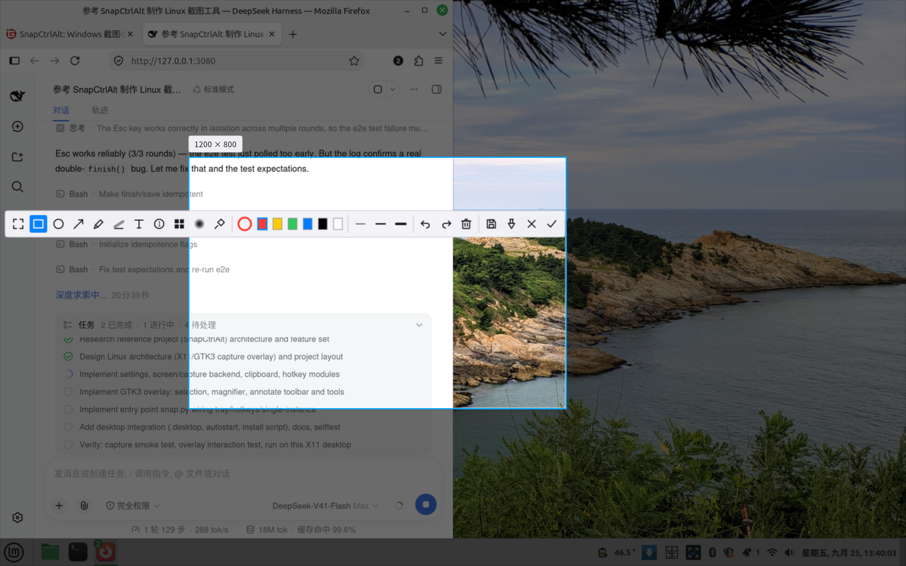

# SnapCtrlAlt Linux

Linux 截图小工具：按 `Ctrl+Alt+D` 全局唤起，框选标注后进剪贴板。交互对标 QQ 截图，
界面用 GTK3 + Cairo，抓图走 X11（Xlib / GDK），除系统自带的 Python 库外不需要编译任何东西。

> 这是 Windows 项目 [SnapCtrlAlt](https://gitee.com/DannyParticle/SnapCtrlAlt) 的 Linux 版移植，
> 保留了它的全部交互设计（工具集、工具栏、快捷键、放大镜、贴图、托盘分流逻辑），
> 渲染层从 Tk 画布 + Pillow 换成 Cairo 直接绘制。



*框选后可拖手柄调整、整体平移，工具栏自绘线性图标，悬停出中文提示。*

## 功能

**框选与选区**

- 拖动框选；拖 8 个手柄改大小；在选区内拖动可整体平移；方向键微调（`Shift` 加速）
- 双击或 `Ctrl+A` 选整屏
- 框选时带 8× 放大镜、十字准星、坐标读数与 `#RRGGBB` 色值，旁边有实时尺寸标签
- 标注过程中在选区外按下即可重新框选（不必 Esc 全退）

**标注工具栏**（Cairo 自绘线性图标，不依赖图标字体，鼠标悬停出中文提示）

| 工具 | 说明 |
|------|------|
| 矩形 / 椭圆 / 箭头 | 常用圈注 |
| 画笔 | 自由涂画，滚轮调线宽 |
| 荧光笔 | 半透明涂抹重点 |
| 文字 | 点击落字，用 Pango 渲染（中文、emoji 都能显示） |
| 序号 | 点击添加 ①②③ 圆形序号，自动递增 |
| 马赛克 / 高斯模糊 | 遮挡敏感信息 |
| 取色 | 读出画面颜色并设为当前描边色 |
| 撤销 / 重做 / 清空 / 另存为 / 贴图 / 取消 / 完成 | 收尾操作 |

**常驻与分流**

- 系统托盘常驻（Ayatana AppIndicator，退回 `Gtk.StatusIcon`）：立即截图、延时截图、
  开机自启、外部工具优先、复制后自动存一份、设置、关于、退出
- 开机自启写 `~/.config/autostart/snapctrlalt.desktop`
- 已装 Flameshot / Spectacle / gnome-screenshot 等外部工具时，可让它们优先接管
  （对标 Windows 版的「优先 QQ 截图」；托盘与设置里随时开关）
- 贴图：把截图钉成置顶小窗，滚轮缩放、右键菜单可复制/保存/调透明度

**Linux 特有的照顾**

- **HiDPI**：X11 根窗口 2880×1800、抓图 5760×3600、GTK 窗口 1440×900 三层坐标系各不相同，
  启动时按 X11 根几何**标定**坐标缩放，导出的是全分辨率原图，不做二次缩放
- **多显示器**：按 Xinerama / RandR 拼出虚拟屏并集，覆盖层铺满整块虚拟屏
- **Wayland**：纯 Wayland 会话自动改走 XDG Desktop Portal（会弹一次系统授权框），
  抓到的图仍进同一套标注界面
- **剪贴板**：写 `image/png` 并调用 `store()`，有剪贴板管理器时**退出程序后仍可粘贴**
- **键盘焦点**：显式 `_NET_ACTIVE_WINDOW` + X11 `set_input_focus` 兜底，
  避免「窗口显示了但 Enter/Esc 跑到别的程序去」

## 安装与运行

**免安装（推荐先试这个）**

```bash
git clone <本仓库> && cd snapctrlalt-linux
./snapctrlalt.sh            # 托盘常驻
```

**安装到 ~/.local**

```bash
./install.sh                # 图标 / 启动器 / 命令行入口
./install.sh --autostart    # 顺便开机自启
./install.sh --uninstall    # 卸载（保留配置）
```

装完直接敲 `snapctrlalt`；也可以在应用菜单里搜「截图工具」。

**依赖**

Linux Mint / Ubuntu / Debian：

```bash
sudo apt install python3-gi python3-gi-cairo python3-cairo python3-pil \
                 gir1.2-gtk-3.0 python3-xlib gir1.2-ayatanaappindicator3-0.1
```

Fedora：

```bash
sudo dnf install python3-gobject python3-cairo python3-pillow gtk3 python3-xlib \
                 libappindicator-gtk3
```

Arch：

```bash
sudo pacman -S python-gobject python-cairo python-pillow gtk3 python-xlib \
               libayatana-appindicator
```

（`requirements.txt` 里有同样的清单与说明。用系统包而不是 pip 装 PyGObject，
可以避免和系统 GTK 版本打架。）

**从源码跑**

```bash
python3 snap.py --selftest     # 不弹界面，基础自检，退出码 0 为通过
python3 snap.py                # 托盘常驻
python3 snap.py --once         # 只截一次，截完退出
python3 snap.py --settings     # 打开设置
python3 tools/diagnose.py      # 环境诊断：这台机器能用哪些能力
python3 tools/perf.py          # 帧耗时基准
```

## 快捷键

| 按键 | 作用 |
|------|------|
| `Ctrl+Alt+D` | 全局唤起截图（可在设置 / `config.json` 改） |
| `Ctrl+Alt+Shift+Q` | 退出程序 |
| `Enter` / `Ctrl+C` | 复制到剪贴板并关闭 |
| `Esc` / 右键 | 取消 |
| `Ctrl+Z` / `Ctrl+Shift+Z` | 撤销 / 重做 |
| `Ctrl+A` / 双击 | 选择整屏 |
| `Ctrl+S` | 另存为… |
| `Ctrl+T` | 贴到桌面 |
| 滚轮 | 调整画笔 / 线宽 |
| `R` `O` `A` `P` `H` `T` `M` `B` `S` | 快速切工具（矩形/椭圆/箭头/画笔/荧光笔/文字/马赛克/模糊/选择） |
| 方向键 / `Shift`+方向键 | 微调选区位置（1px / 10px） |

## 配置

配置文件：`~/.config/snapctrlalt/config.json`（便携模式见下）

| 键 | 默认 | 含义 |
|----|------|------|
| `hotkey` | `ctrl+alt+d` | 唤起热键（留空则不注册全局热键） |
| `quit_hotkey` | `ctrl+alt+shift+q` | 退出热键 |
| `autostart` | `false` | 开机自启 |
| `save_dir` | 空 | 自动保存目录；空则用系统图片目录 |
| `after_capture` | `copy` | 完成后动作：`copy` / `copy_save` / `save` |
| `copy_to_primary` | `false` | 同时写 X11 PRIMARY 选区（中键粘贴） |
| `prefer_external` | `true` | 优先调用外部截图工具 |
| `external_cmd` | 空 | 自定义外部截图命令，空则自动探测 |
| `show_tray` | `true` | 显示托盘图标 |
| `notify` | `true` | 显示桌面通知 |
| `delay` | `0` | 托盘「延时截图」用的秒数 |
| `save_format` | `png` | 自动保存格式：`png` / `jpg` |
| `jpeg_quality` | `95` | JPEG 质量 |

Windows 版的 `config.json` 可以直接拿来用（`prefer_qq` / `qq_hotkey` 会自动映射）。

**便携模式**：在项目根目录放一个名为 `portable` 的空文件，配置就写在程序目录里。

## 模块

| 文件 | 职责 | 对应 Windows 版 |
|------|------|----------------|
| `snapctrlalt/snap.py` | 入口、托盘常驻、热键分发、设置界面、单实例 IPC | `snap.py` |
| `snapctrlalt/overlay.py` | 全屏覆盖层：选区、工具栏、标注渲染、放大镜、贴图触发 | `overlay.py` |
| `snapctrlalt/capture_linux.py` | 虚拟屏度量 + 抓图（GDK → Xlib → Portal 三级回落） | `capture.py` |
| `snapctrlalt/hotkey_linux.py` | `XGrabKey` 全局热键，注册失败会提示 | `hotkey.py` |
| `snapctrlalt/clipboard_linux.py` | GTK 剪贴板写位图 / 文本 | `clipboard_win.py` |
| `snapctrlalt/tray_linux.py` | Ayatana AppIndicator 托盘（退回 StatusIcon） | `tray.py` |
| `snapctrlalt/pin_window.py` | 贴图小窗 | —（Windows 版并入覆盖层） |
| `snapctrlalt/notify_linux.py` | 桌面通知（DBus，退回 notify-send） | 托盘气泡 |
| `snapctrlalt/settings.py` | JSON 配置（XDG）+ autostart .desktop | `settings.py` |
| `tools/make_icons.py` | 用 Cairo 生成 SVG / PNG 图标（无外部素材） | `packaging/*.ico` |
| `tools/diagnose.py` | 环境诊断 | — |
| `tools/perf.py` | 帧耗时基准 | 测试脚本里的耗时统计 |

**外部工具分流**（对标 Windows 版的 `qq_bridge.py`）：Linux 上没有 QQ 截图可转发，
改成探测 Flameshot / Spectacle / gnome-screenshot / xfce4-screenshooter / ksnip /
scrot / maim / ImageMagick `import`，命中就交给它；起不来则回落到内置覆盖层。
每种情况都会打印原因，不会静默失败。

## 开发与测试

```bash
python3 tests/test_overlay.py     # 界面回归：54 项，离屏跑真实覆盖层对象
python3 tests/test_gui_e2e.py     # 端到端：真窗口 + XTEST 真鼠标拖框 + 真剪贴板（约 20 秒）
python3 snap.py --selftest        # 基础自检：配置 / 抓图 / 剪贴板 / 热键 / 托盘 / 渲染
python3 snap.py --perf            # 用真实抓图尺寸测各交互路径帧耗时
```

端到端测试会短暂接管鼠标（约 20 秒），跑完不留后台进程；它用隔离的
`XDG_CONFIG_HOME`，不会动你的配置。

**性能**（本机 2880×1800 @2x，抓图 5760×3600，40 帧实测）

| 路径 | 平均 | 约合 |
|------|------|------|
| 悬停 / 放大镜 | 0.7 ms | 1400+ fps |
| 拖框创建 | 1.1 ms | 870 fps |
| 拖动选区 | 2.0 ms | 500 fps |
| 标注态（8 个标注 + 工具栏） | 2.1 ms | 490 fps |
| 绘制预览 | 1.7 ms | 600 fps |

关键优化（对应 Windows 版的建/调/移/标注四路径优化）：

1. **画布按事件坐标建，1:1 绘制**——不每帧把 5760² 的图重采样到屏幕尺寸
   （这一项把该路径从 13.9 ms 压到 5.5 ms）
2. **选区外只画四条压暗边带**，不做整屏合成
3. **工具栏整条缓存成一张 surface**，悬停/拖动只换贴图位置
4. **马赛克/模糊效果图只算一次**并挂在标注对象上
5. **形状是绘图指令列表**，每帧直接重画，撤销/重做不碰像素

`python3 tools/perf.py` 可复现（参数：抓图宽 高 坐标缩放 [屏幕逻辑宽 高]）。

## 已知问题

- 纯 Wayland 下抓图走 Portal，会弹一次系统授权框；覆盖层本身仍可正常标注
- 个别窗口管理器对「抢焦点」有限制，若 Enter/Esc 不响应，点一下画面即可（程序也会自动重试）
- 没有剪贴板管理器时，剪贴板内容在本进程退出后失效（Gtk 剪贴板的选区所有者模型）
- 视频播放器 / 硬件覆盖层（X11 overlay plane）里的画面可能抓成黑块，这是 X11 的固有限制

## 许可与作者

- 许可：[MIT](LICENSE)
- 交互与功能设计来自 Windows 版 SnapCtrlAlt（作者 mimo、DeepSeek Harness 与 DannyParticle）
